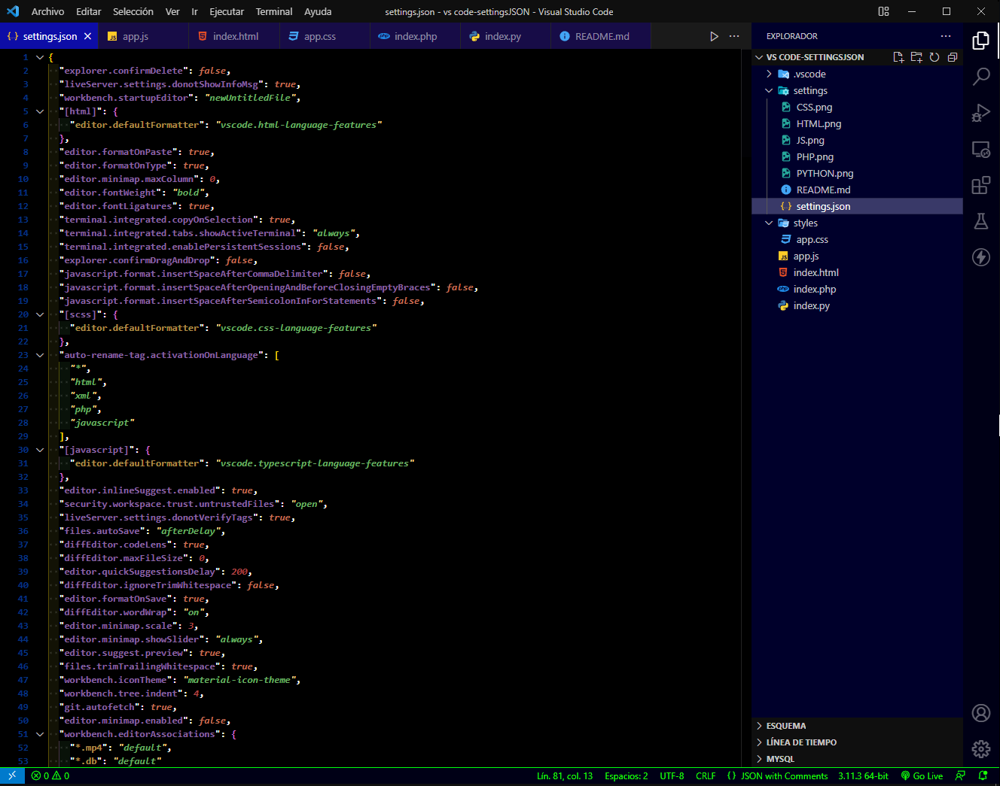
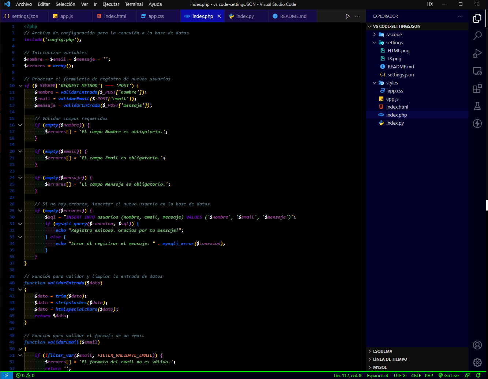
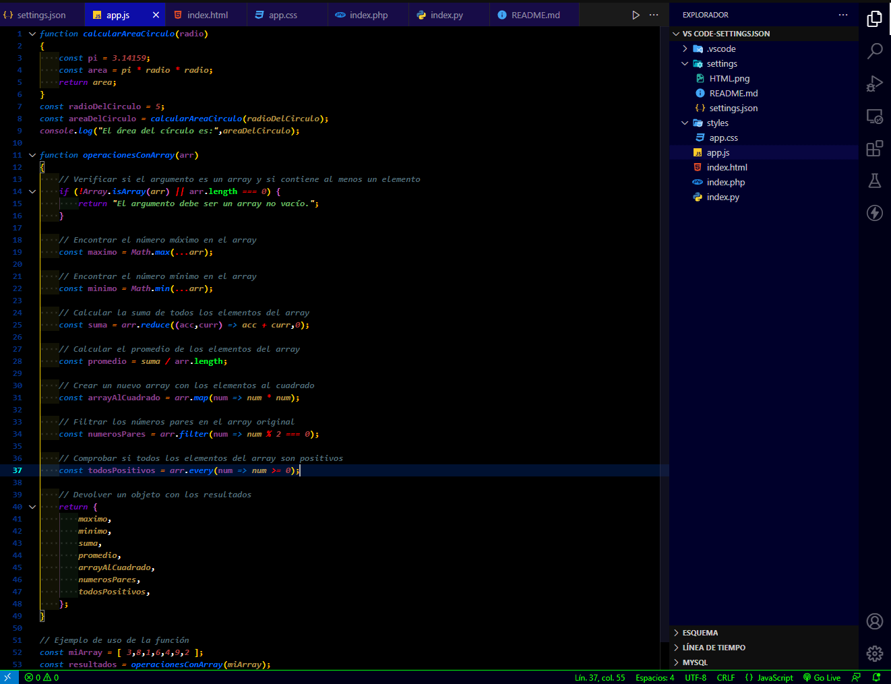
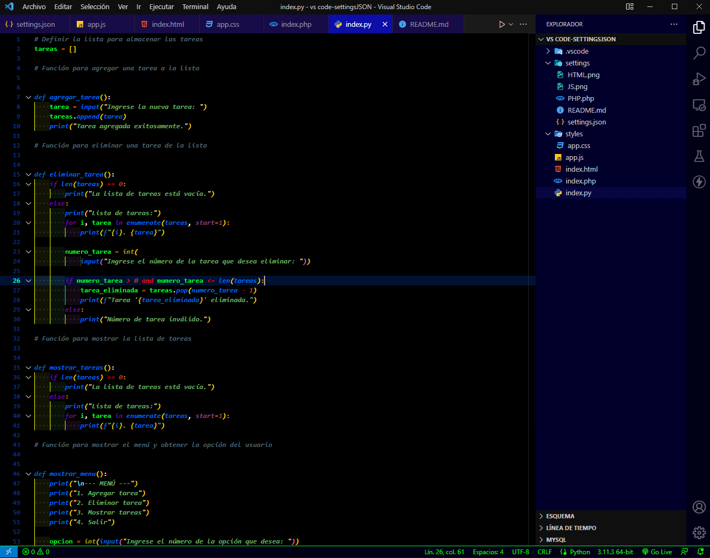
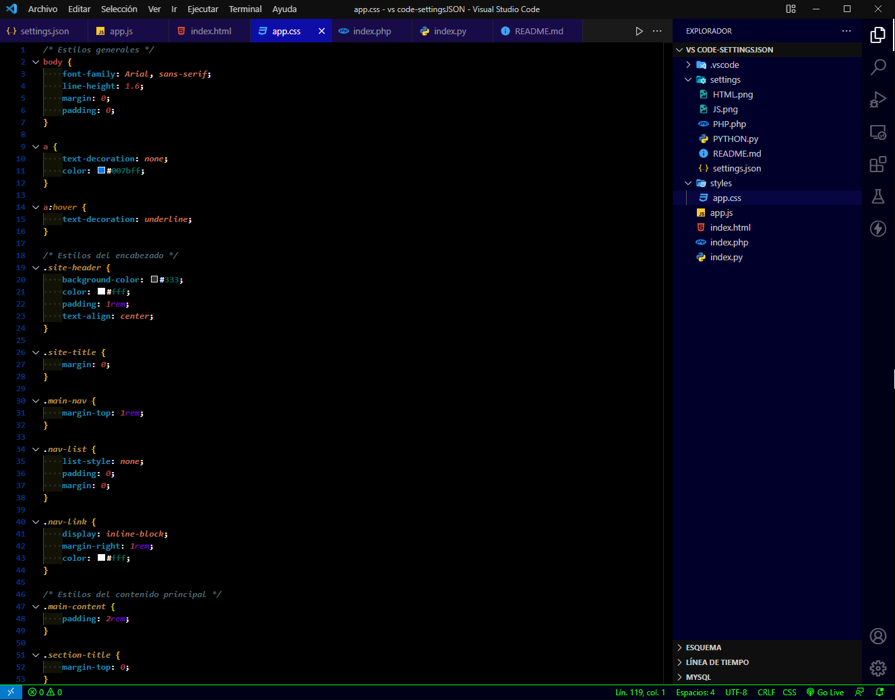
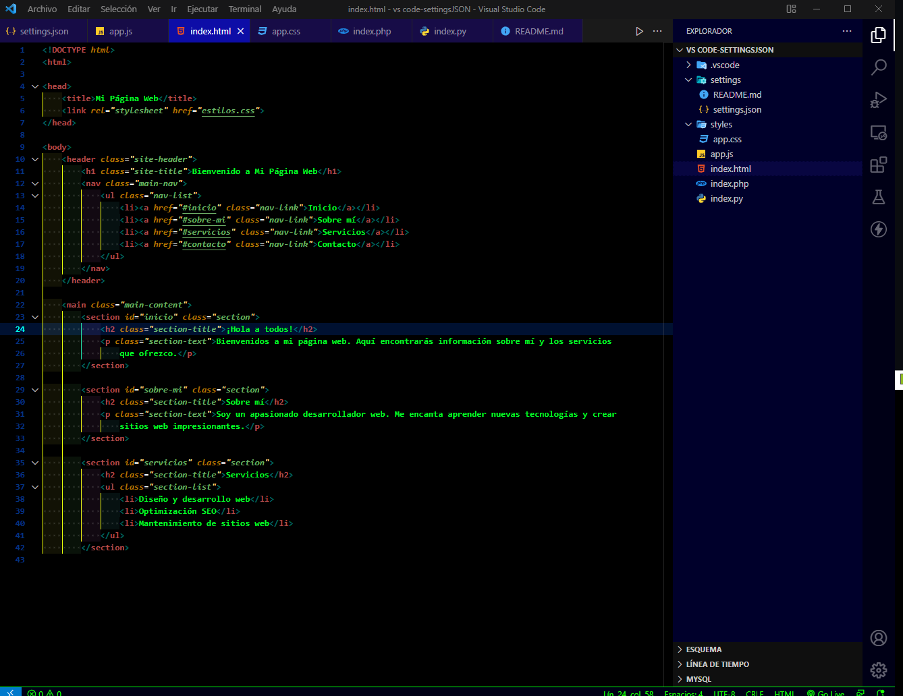

# SETTINGS.JSON para Visual Studio Code

Descarga el archivo y reemplaza el archivo `settings.json` de tu VS Code.

**IMPORTANTE:** Recuerda hacer un respaldo de tu configuración original por si llega a ser necesario.

### En Visual Studio Code

1. En la barra de menú superior, selecciona la opción "Archivo" (File) y luego "Preferencias" (Preferences).
2. En el menú desplegable de "Preferencias", elige "Configuración" (Settings). Esto abrirá una nueva pestaña en el editor con las opciones de configuración de VS Code.
3. En la parte superior derecha de la pestaña de configuración, verás un icono de tres puntos verticales (⠇). Haz clic en ese icono.
4. Aparecerá un menú desplegable. Selecciona "Abrir archivo de configuración" (Open Settings JSON).
5. Una vez que selecciones "Abrir archivo de configuración", se abrirá el archivo `settings.json` en el editor de VS Code. Este archivo contiene las configuraciones personalizadas para tu entorno de trabajo, incluyendo extensiones, temas, opciones de editor, y más.
6. Puedes editar el archivo `settings.json` directamente en el editor para modificar o agregar configuraciones según tus preferencias. Las configuraciones se guardarán automáticamente.

Si prefieres una forma más directa de acceder al archivo `settings.json`, también puedes presionar las siguientes combinaciones de teclas:

- **Windows/Linux:** `Ctrl + Coma` (`Ctrl+,`).
- **macOS:** `Comando + Coma` (`Cmd+,`).

Esto abrirá directamente el archivo `settings.json` en el editor de VS Code.

